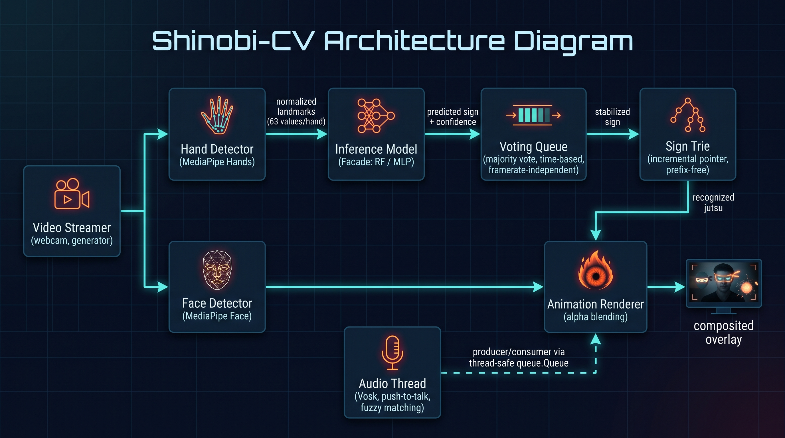

# Shinobi-CV — Naruto Hand Sign Gesture Recognition

A real-time multimodal system that recognizes Naruto-inspired hand signs via classical computer vision, combines them into sequences using a Trie data structure, and triggers graphical overlays and "dojutsu" effects (Sharingan/Byakugan) via voice commands.

> **What it is, in a sentence:** an end-to-end educational project covering computer vision (MediaPipe), classical machine learning (Random Forest / MLP), data structures (Trie), system design (streaming, producer-consumer, multithreading), and packaging (Docker) — built as a proof of concept, not a finished product.

<video src="poc_github.mp4" controls width="100%"></video>

<!--  -->

About the demo: signs are vouluntarly wrong with respect to the Naruto world. These are just two of the easiest to recognise by the system to make the demo short. 

Points drawn on face are there just to show the points the model sees. Comment lines from 130 to 135 of live_inference.py to hyde them.

P.s.: I've not spent much time in the selection of images 😅

---

## Table of Contents

- [What it does](#what-it-does)
- [Why this project](#why-this-project)
- [Architecture](#architecture)
- [Technical decisions and solved problems](#technical-decisions-and-solved-problems)
- [Tech stack](#tech-stack)
- [Repository structure](#repository-structure)
- [How to run it](#how-to-run-it)
- [Usage](#usage)
- [Tests](#tests)
- [Known limitations and roadmap](#known-limitations-and-roadmap)
- [License and disclaimer](#license-and-disclaimer)

---

## What it does

1. The webcam detects hand signs (12 Naruto-style *hand seals*) via normalized spatial landmarks.
2. An ML classifier (Random Forest or MLP, interchangeable) predicts the current sign, stabilized by a temporal voting system.
3. A sequence of recognized signs is searched in real-time in a Trie: if it matches a registered *jutsu*, an overlay animation is triggered (e.g., fireball from the mouth).
4. In parallel, an audio thread (push-to-talk) recognizes voice commands ("Sharingan", "Byakugan") and toggles persistent overlays anchored to the eyes, tracked via Face Landmark detection.

Everything runs in real-time on the CPU, no GPU required.

## Why this project

This is not a MediaPipe tutorial: it was built as a software engineering exercise applied to a CV/ML problem, with the explicit goal of:

- Building a data collection → training → real-time inference pipeline from scratch, including its pitfalls (see below: data leakage).
- Applying design patterns (Facade, Strategy/polymorphism, composition vs inheritance) to a real problem, not a textbook exercise.
- Tackling synchronization between components running at different speeds (video at 30 FPS, audio on sporadic events) using multithreading.
- Discovering and honestly documenting the limitations of the tools used (e.g., the limits of generic ASR on a custom vocabulary), instead of hiding them.

## Architecture

The system is divided into four logically independent modules:



## Technical decisions and solved problems

This section documents the non-obvious problems encountered during development and how they were solved — this is the part worth reading if you are here to understand *how* it was built, not just *what* it does.

### 1. Geometric invariance of landmarks

Raw MediaPipe landmarks depend on the hand's position in the frame and its distance from the camera. Before training, each hand is:
- **translated** by subtracting the wrist coordinates from all points (position invariance),
- **scaled** by dividing by the maximum absolute value of the vector (distance/size invariance).

The same principle, applied with different goals, returns in the rendering module: there, we need **absolute pixel coordinates** (not normalized), because the goal is not to train a model but to draw an overlay at the correct point on the screen. Two different preprocessings for two different purposes, starting from the same raw data.

### 2. Data leakage discovered via blind test

The first trained Random Forest reported an accuracy of **1.0** on the test set — a red flag, not a success. Cause: the train/test split was done on frames extracted from a continuous video stream, so nearly identical frames (due to temporal autocorrelation) ended up in both train and test sets. A blind test with data collected in a separate session (different angles and positions) revealed the model's true generalization, which was much lower — confirming that the MLP generalized better than the RF on this specific problem.

### 3. Framerate-independent voting system

Prediction stabilization (to prevent the displayed sign from "flickering" frame by frame) initially used a consecutive frame counter. After a refactoring that changed the system's actual framerate, the threshold — calibrated in number of frames — ended up representing a completely different real-time window. The solution: anchor the threshold to `time.time()`, not the frame count, making the user-perceived behavior stable regardless of how fast the pipeline is running at that moment.

### 4. Sequence recognition via Trie with prefix-free property

*Jutsu* are sequences of signs. A Trie with an incremental pointer (which advances from node to node with each newly recognized sign, instead of re-searching the entire sequence from scratch) allows for O(1) recognition per step. The structure imposes an explicit constraint, verified at build time: **no jutsu formula can be a prefix of another** — the same property as prefix-free codes (e.g., Huffman coding), which is necessary so the system always knows, without ambiguity, when a sequence is "complete".

### 5. Alpha blending with robust boundary handling

The animation overlays (fireball, Sharingan, Byakugan) require pixel-by-pixel alpha blending between an RGBA image and the webcam's BGR frame. The edge case — the overlay image spilling partially or **entirely** outside the frame (e.g., user near the edge, or scale reduced to minimum) — requires explicit clipping: naive NumPy slicing with negative indices does not produce an empty range but "wraps around" from the other end of the array, causing a silent and hard-to-reproduce broadcasting error. The fix applies `max(0, ...)` to both the start and stop of each axis, ensuring consistency even in the degenerate case.

### 6. The audio module journey: from generic ASR to push-to-talk + fuzzy matching

The first approach (continuous listening with Vosk, Japanese model, exact string matching) failed almost systematically: "Sharingan" and "Byakugan" are not words in the standard Japanese vocabulary, and an ASR engine forces recognition towards the closest words that *do exist* in its vocabulary. Empirical debugging (comparing Italian/English/Japanese models, directly inspecting the transcribed text) revealed that:
- the **Italian** model recognizes "sharing" extremely stably (the Italianized pronunciation of "Sharingan" phonetically collapses onto this English word),
- "Byakugan" doesn't have an equally stable phonetic anchor in any of the tested languages.

The final solution combines three fixes: **push-to-talk** (holding a key, eliminates continuous listening noise), **fuzzy matching** (edit distance instead of exact equality, to absorb phonetic variation), and a **separate thread** with `queue.Queue` for producer-consumer communication with the video loop, including a small `sleep()` in the polling cycle to avoid blindly saturating the CPU.

## Tech stack

| Area | Tool |
|---|---|
| Hand & Face landmark detection | MediaPipe Tasks (Hand Landmarker, Face Landmarker) |
| Sign classification | scikit-learn (Random Forest), PyTorch (MLP) |
| Computer vision / rendering | OpenCV |
| Voice recognition | Vosk (offline, push-to-talk) |
| Fuzzy string matching | RapidFuzz |
| Dependency management | uv |
| Testing | pytest |
| Containerization | Docker / Docker Compose |

## Repository structure

```
shinobi-cv/
├── src/shinobi_cv/
│   ├── video_streamer.py       # frame source (generator, webcam)
│   ├── hand_tracking.py        # HandDetector: normalized landmarks
│   ├── face_landmark_detection.py  # FaceLandMarkDetection
│   ├── animation.py            # Animation (ABC), TimedAnimation, ToggleAnimation, Renderer
│   ├── sign_search.py          # SignTrie
│   ├── audio.py                # AudioDetector (Vosk, push-to-talk, fuzzy matching)
│   ├── live_inference.py       # main loop orchestration
│   ├── main.py                 # entrypoint, logging, dependency injection
│   └── config.py
│   ├── src/data/                       # collected datasets (CSV)
│   ├── src/training/                   # RF/MLP notebooks and experiments
│   ├── src/research/                   # unintegrated R&D (GNN, custom audio classifier)
├── tests/                      # pytest
├── Dockerfile.app
├── docker-compose.yml
├── pyproject.toml
└── uv.lock
```

## How to run it

### Prerequisites

- Python 3.12+, [uv](https://docs.astral.sh/uv/)
- A webcam and a microphone
- (Optional) Docker + Docker Compose

### Local (without Docker)

```bash
uv sync
uv run -m src.shinobi_cv.main
```

### Docker — Native Linux

```bash
docker compose up --build
```

The `/dev/video0` device is passed directly to the container. If your webcam has a different index, update the `docker-compose.yml`.

### Docker — WSL2

Tested on WSL2 with WSLg. Requires a one-time manual step to expose the webcam to WSL:

```bash
# From PowerShell (administrator), on the Windows host
usbipd list
usbipd bind --busid <BUSID_WEBCAM>
usbipd attach --wsl --busid <BUSID_WEBCAM>
```

Then:
```bash
docker compose up --build
```

The `docker-compose.yml` mounts `/tmp/.X11-unix` and `/mnt/wslg/PulseServer` to pass graphical display and audio respectively — these paths are **specific to WSLg** and must be adapted for other configurations (e.g., native Linux, where the PulseAudio socket typically lives in `/run/user/<uid>/pulse/native`).

## Usage

- Show a sign with both hands to the webcam for a few moments: it gets registered in the current sequence.
- Complete a valid sequence (e.g., Horse → Tiger) to cast a jutsu and see the animation.
- Hold down `space` and say "Sharingan" or "Byakugan" to toggle the eye overlay.
- `q` to quit.

Registered jutsu and their corresponding sequences are defined in `config.py`.

## Tests

```bash
uv run pytest tests/
```

> If you have ROS installed on your system, its pytest plugins might interfere with the test launch (missing `yaml` dependency in their path). In that case:
> ```bash
> PYTHONPATH="" uv run pytest tests/
> ```

Tests cover: the prefix-free property and retry behavior of the `SignTrie`, the correctness of the geometric landmark normalization, and the common interface (Facade) between the inference models.

## Known limitations and roadmap

This is a **proof of concept**, with a deliberately limited scope to prioritize engineering depth on a few features over breadth:

- **Dataset**: 6 out of the 12 classic signs are covered; extending to the remaining 6 is a matter of data collection, not architecture.
- **Byakugan** has a lower voice recognition rate than Sharingan — a phonetic limitation of matching on a generic ASR, discussed above.
- **Only one person in frame** is assumed by the system; the presence of other faces can cause transient visual artifacts in tracking the target face.
- **No horizontal frame flip** — the view is not "mirrored"; this is a scope choice, not a technical limitation.

R&D Roadmap (explored only in `research/`, not integrated):
- A **Graph Neural Network** layer for sign classification, leveraging the topological structure of the hand instead of a flat coordinate vector.
- A **custom keyword-spotting classifier** for "Sharingan"/"Byakugan", trained on a small ad-hoc collected dataset, as a more robust alternative to fuzzy matching on generic ASR.

## License and disclaimer

Personal project for educational, non-commercial purposes. References to names and concepts from the work *Naruto* (© Masashi Kishimoto / Shueisha / Studio Pierrot) are used exclusively for learning and example purposes, with no affiliation to the rights holders.

Code distributed under the [MIT](LICENSE) license <!-- TODO: add LICENSE file if applicable -->.