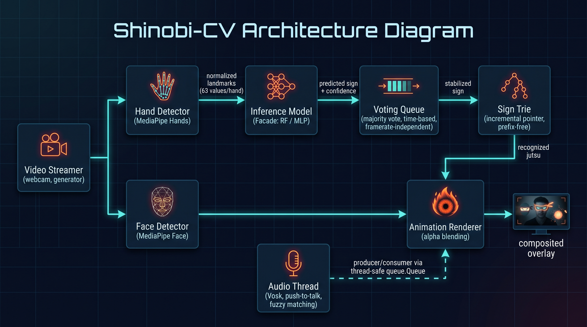

# Shinobi-CV: Naruto Hand Sign Recognition

A real-time, multimodal proof of concept: it recognizes Naruto-inspired hand signs from the webcam with classical machine learning on MediaPipe landmarks, matches sequences of signs with a Trie, and triggers graphical overlays. Voice commands toggle "dojutsu" eye effects (Sharingan / Byakugan).

> **In one sentence:** an educational, end-to-end project covering computer vision (MediaPipe), classical machine learning (Random Forest / MLP), a data structure (Trie), multithreading (video loop + audio thread) and packaging (Docker). It is a proof of concept, not a finished product.

<!-- DEMO VIDEO: in GitHub's web editor, drag the compressed demo video here; GitHub will insert its link. Then delete this comment. -->

About the demo: the signs are deliberately different from the ones in the show. The demo uses Horse → Rat, which are two of the signs the system recognizes most easily, to keep the video short. The small squares drawn on the face and hands only show the points the system tracks; to hide them, remove the drawing loop (`cv.rectangle`, around line 135 of `src/shinobi_cv/live_inference.py`). The overlay images are quick placeholders.

---

## Table of Contents

- [What it does](#what-it-does)
- [Why this project](#why-this-project)
- [Architecture](#architecture)
- [Technical decisions and solved problems](#technical-decisions-and-solved-problems)
- [Tech stack](#tech-stack)
- [Repository structure](#repository-structure)
- [How to run it](#how-to-run-it)
- [Usage](#usage)
- [Tests](#tests)
- [Known limitations](#known-limitations)
- [Possible extensions](#possible-extensions)
- [Disclaimer](#disclaimer)

---

## What it does

1. The webcam feed is analysed with MediaPipe. A sign is read only when **two hands (one left, one right)** are visible. The classifier knows **6 of the 12 classic Naruto hand seals** (the ones I collected data for).
2. A classifier (Random Forest or MLP, selected in `config.py`) predicts the sign. To avoid flickering, predictions are taken at most every 0.2 s, only confident ones (> 0.7) enter a sliding window of the last 10, and a sign is accepted when it has more than 5 votes.
3. Accepted signs advance a pointer in a Trie of jutsu sequences. Completing a sequence triggers an overlay. Currently only the **Great Fireball** (Horse → Rat) has an animation.
4. In parallel, an audio thread (push-to-talk with the space bar) recognizes the words "Sharingan" and "Byakugan" offline and toggles eye overlays, anchored to the eyes with MediaPipe's Face Landmarker.

Everything runs on the CPU; no GPU is needed.

## Why this project

It is not a MediaPipe tutorial: it is a software engineering exercise applied to a computer vision / machine learning problem, with these goals:

- Build a data collection → training → real-time inference pipeline from scratch, including its pitfalls (see data leakage below).
- Practice object-oriented design on a real problem: a common interface for the two classifiers (`Inference_Model`) and an abstract `Animation` class with timed and toggle subclasses.
- Synchronize components that run at different speeds (continuous video frames, sporadic audio events) using a thread and a queue.
- Document the limits of the tools I used (for example, generic speech recognition on a custom vocabulary) instead of hiding them.

## Architecture

The system is divided into four modules:



## Technical decisions and solved problems

The non-obvious problems I ran into, and how I handled them.

### 1. Geometric invariance of landmarks

Raw MediaPipe landmarks depend on where the hand is in the frame and how far it is from the camera. Before training, each hand is:
- **translated**: the wrist coordinates are subtracted from all points (position invariance);
- **scaled**: divided by the maximum absolute value of the vector (distance/size invariance).

The rendering module needs the opposite: **absolute pixel coordinates**, because the goal is to draw an overlay at the right place on screen. Same raw data, two different preprocessings for two different purposes.

### 2. Data leakage found with a blind test

On a random train/test split of the collected frames, the models looked excellent: **98% (Random Forest) and 99% (MLP)** accuracy on 149 test samples. The frames come from a continuous video, so nearly identical neighbouring frames end up in both sets, which most likely inflates those numbers. A **blind test** on data from a separate session (same person and room, different light and slightly more motion; 86 samples) gave **58% for the Random Forest and 79% for the MLP**. So the MLP generalized better, and neither is close to the random-split figure.

Caveat: the blind test is still one person in one environment. The default model in config.py is the Random Forest because, in my informal use, it reacted faster and with more confident predictions (not measured); the MLP generalized better in the blind test. Set MODEL = _MLP_MODEL to use it.

### 3. Time-based stabilization of predictions

To keep the displayed sign from flickering, predictions are throttled in time (`TIME_TO_CONFIRM = 0.2` s) and voted over a sliding window of the last 10 confident predictions (confidence > 0.7); a sign is accepted with more than 5 votes. My first version counted frames: after a refactoring changed the real frame rate, the same frame threshold meant a very different time window. Anchoring the logic to `time.time()` made the behaviour independent of how fast the pipeline runs.

### 4. Sequence recognition with a prefix-free Trie

Jutsu are sequences of signs. A Trie with an incremental pointer (it moves one node per newly accepted sign, instead of searching the whole sequence again) gives constant work per step. The structure needs a constraint, enforced with an `assert` when the Trie is built: **no jutsu sequence can be a prefix of another**, as in prefix-free codes (e.g. Huffman). This guarantees the system always knows unambiguously when a sequence is complete.

### 5. Alpha blending with safe boundaries

The overlays (fireball, Sharingan, Byakugan) need pixel-wise alpha blending between an RGBA image and the BGR webcam frame. If the overlay falls partly or **entirely** outside the frame (user near the edge, minimum scale), plain NumPy slicing with negative indices does not give an empty range: it wraps around the array and causes a silent, hard-to-reproduce error. The code clips both the start and the stop of each axis with `max(0, ...)`.

### 6. Audio: from continuous ASR to push-to-talk and fuzzy matching

My first approach (continuous listening with Vosk, Japanese model, exact string match) failed almost systematically: "Sharingan" and "Byakugan" are not ordinary Japanese words, and a speech recognizer pushes its output towards the closest words that do exist in its vocabulary. Comparing the Italian, English and Japanese models directly on the transcribed text, I found that:
- the **Italian** model transcribes "Sharingan" quite stably as "sharing" (the Italian pronunciation collapses onto that English word);
- "Byakugan" has no equally stable anchor in any of the languages I tried.

The final version combines **push-to-talk** (hold space; removes continuous noise), **fuzzy matching** (RapidFuzz `partial_ratio`, threshold 60, against the Latin and Japanese spellings) and a **separate thread** that sends results to the video loop through a `queue.Queue`, with a short `sleep()` in the polling loop to avoid saturating the CPU. These findings come from informal tests, not from a measured benchmark.

## Tech stack

| Area | Tool |
|---|---|
| Hand and face landmarks | MediaPipe Tasks (Hand Landmarker, Face Landmarker) |
| Sign classification | scikit-learn (Random Forest), PyTorch (MLP) |
| Computer vision / rendering | OpenCV |
| Voice recognition | Vosk (offline, push-to-talk), PyAudio, pynput |
| Fuzzy string matching | RapidFuzz |
| Dependency management | uv |
| Testing | pytest |
| Containerization | Docker / Docker Compose |

## Repository structure

```
shinobi-cv/
├── src/
│   ├── shinobi_cv/
│   │   ├── main.py                     # entrypoint: logging, wiring of the components, audio thread
│   │   ├── live_inference.py           # main loop, classifier wrapper (Inference_Model)
│   │   ├── hand_tracking.py            # HandDetector: normalized landmarks
│   │   ├── face_landmark_detection.py  # face landmarks
│   │   ├── sign_search.py              # SignTrie
│   │   ├── animation.py                # Animation (ABC), TimedAnimation, ToggleAnimation, Renderer
│   │   ├── audio.py                    # AudioDetector (Vosk, push-to-talk, fuzzy matching)
│   │   ├── video_streamer.py           # frame source (generator over the webcam)
│   │   ├── data_collection.py          # script used to collect the training data
│   │   ├── config.py
│   │   └── animations/                 # overlay images
│   ├── training/                       # notebook with the experiments, MLP definition
│   ├── data/                           # collected datasets (signs.csv, blind_test.csv)
│   └── models/                         # trained classifiers (rf_model.pkl, mlp_model.pth)
├── tests/
├── Dockerfile.app
├── docker-compose.yaml
├── pyproject.toml
└── uv.lock
```

## How to run it

### Model files (not in the repository)

The MediaPipe and Vosk models are not included (they are not mine and are large). Put them in `src/models/`:

- `hand_landmarker.task`: MediaPipe Hand Landmarker, [download](https://storage.googleapis.com/mediapipe-models/hand_landmarker/hand_landmarker/float16/1/hand_landmarker.task).
- `face_landmarker_v2_with_blendshapes.task`: MediaPipe Face Landmarker, [download](https://storage.googleapis.com/mediapipe-models/face_landmarker/face_landmarker/float16/1/face_landmarker.task), saved with this file name.
- `vosk-model-small-it-0.22/`: small Italian Vosk model, unzipped; see the [Vosk models page](https://alphacephei.com/vosk/models). The English and Japanese models can be used by changing `AUDIO_MODEL_PATH` in `config.py`.

The trained classifiers and the datasets are already in the repository.

### Prerequisites

- Python 3.12+ and [uv](https://docs.astral.sh/uv/)
- A webcam and a microphone
- On Linux, PyAudio needs the system package `portaudio19-dev`
- (Optional) Docker and Docker Compose

### Local (without Docker)

```bash
uv sync
uv run -m src.shinobi_cv.main
```

### Docker, native Linux

The model files are copied into the image at build time, so put them in `src/models/` **before** building.

```bash
docker compose up --build
```

The `/dev/video0` device is passed to the container. If your webcam has a different index, edit `docker-compose.yaml`.

### Docker, WSL2

Tested on WSL2 with WSLg. It needs a one-time step to expose the webcam to WSL:

```bash
# From PowerShell (administrator), on the Windows host
usbipd list
usbipd bind --busid <BUSID_WEBCAM>
usbipd attach --wsl --busid <BUSID_WEBCAM>
```

Then:

```bash
docker compose up --build
```

`docker-compose.yaml` mounts `/tmp/.X11-unix` and `/mnt/wslg/PulseServer` to pass the display and the audio. These paths are **specific to WSLg** and must be adapted for other setups (on native Linux the PulseAudio socket is typically in `/run/user/<uid>/pulse/native`).

## Usage

- Show a sign with both hands for a moment; it is added to the current sequence.
- Complete the registered sequence, **Horse → Rat**, to cast the Great Fireball and see the animation.
- Hold `space` and say "Sharingan" or "Byakugan" to toggle the eye overlay.
- `q` quits.

The sequences are defined in `config.py`.

## Tests

```bash
uv run pytest tests/
```

> If ROS is installed on your system, its pytest plugins may interfere with the test run (missing `yaml` in their path). In that case: `PYTHONPATH="" uv run pytest tests/`

`tests/generic_test.py` has three tests: the Trie search and restart behaviour, the shape and centring of the landmark preprocessing, and the fact that both classifiers expose the same inference interface. The prefix-free check is an `assert` in `SignTrie` and is not covered by a test.

## Known limitations

This is a **proof of concept** with a deliberately small scope:

- **Dataset:** 6 of the 12 classic signs are covered, collected from one person in one environment. Extending to the other 6 is a data collection task, not an architectural one.
- **One jutsu:** only the Great Fireball (Horse → Rat) has an animation.
- **Byakugan** was recognized less reliably than Sharingan in my informal tests, because of the phonetic limitation of generic speech recognition described above.
- **One person in the frame** is assumed; other faces can cause transient artefacts when tracking the target face.
- **No mirrored view:** the frame is not flipped horizontally (a scope choice).

## Possible extensions

Ideas only: they are not implemented and I do not plan to work on them in the short term.

- A **Graph Neural Network** classifier that uses the topology of the hand instead of a flat vector of coordinates.
- A **custom keyword-spotting model** for "Sharingan" / "Byakugan", trained on a small dataset collected for the purpose, as a more robust alternative to fuzzy matching on generic speech recognition.

## Disclaimer

Personal project for educational, non-commercial purposes. Names and concepts from the work *Naruto* (© Masashi Kishimoto / Shueisha / Studio Pierrot) and the overlay images are used only for learning and as examples, with no affiliation to the rights holders.
